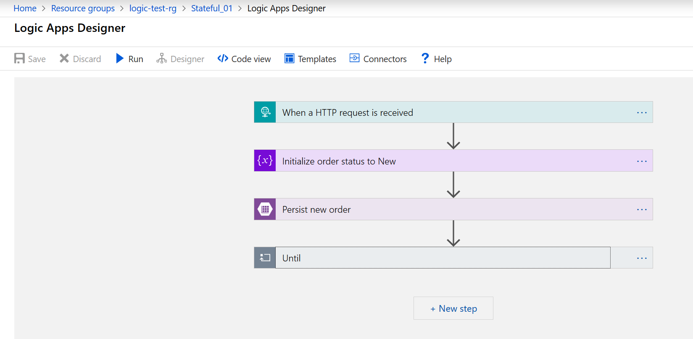
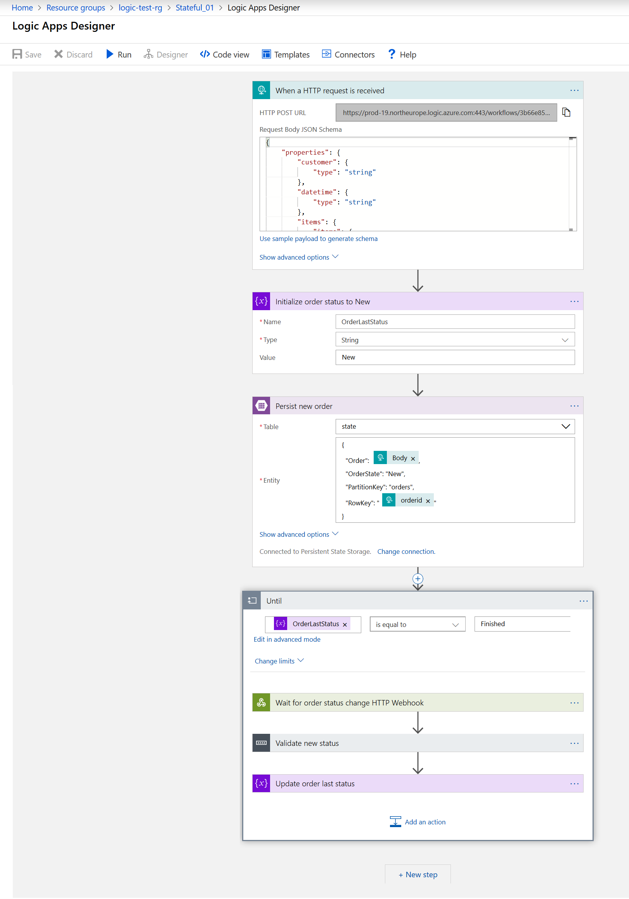
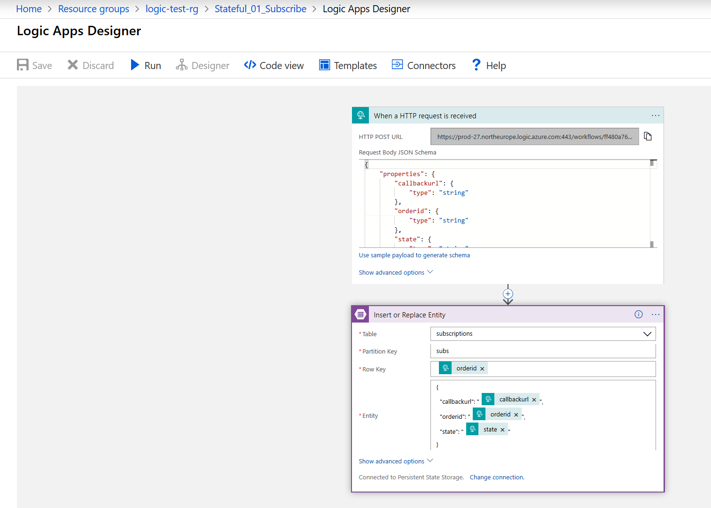
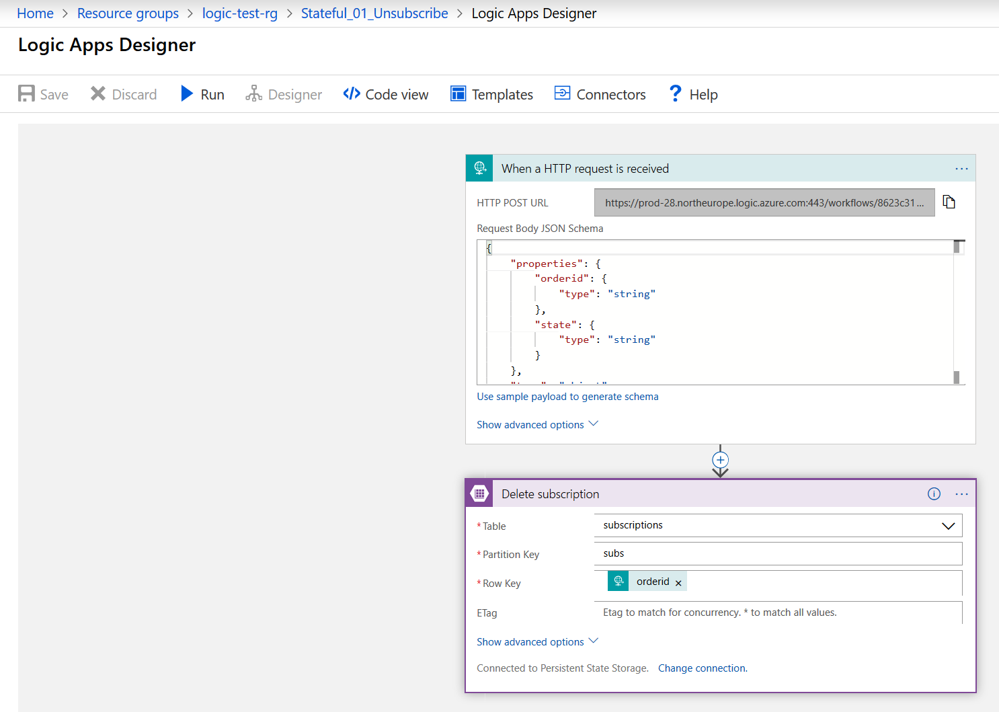
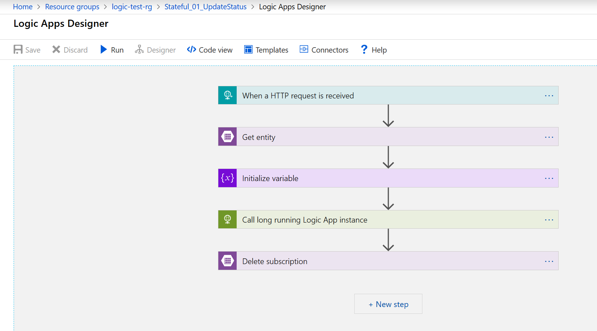
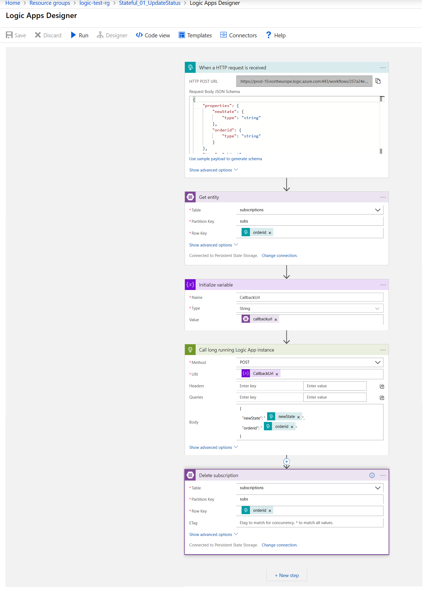
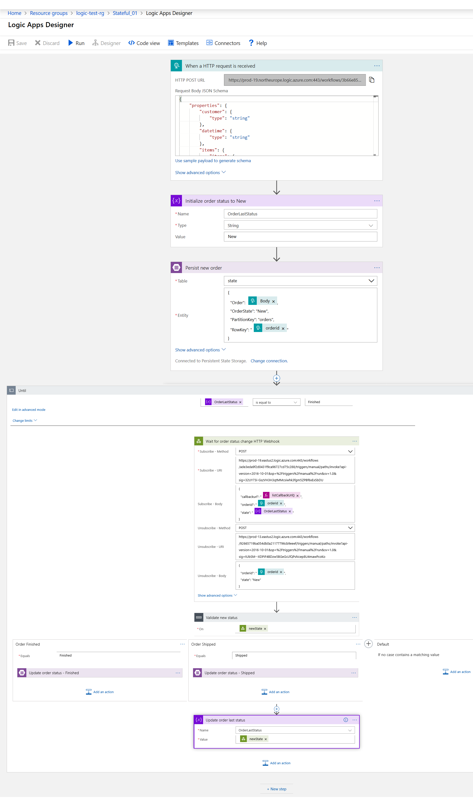
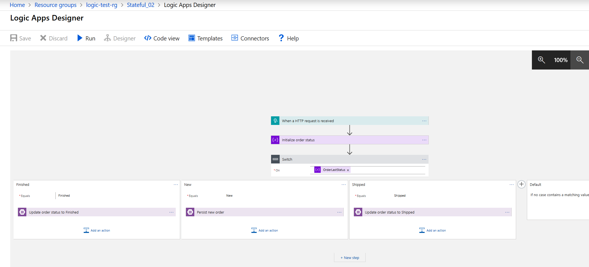
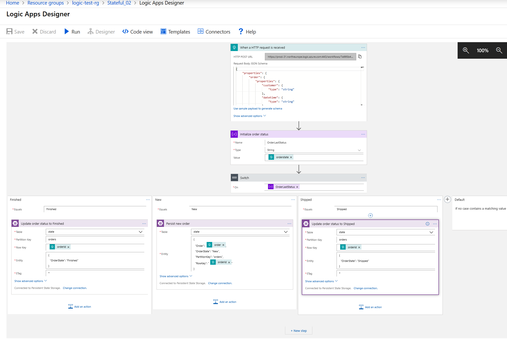

# stateful-logic-apps

The goal of these Logic Apps demos is to show how we could create workflows that need to persist state. I am exploring 2 ways of achieving it:
- Using Logic Apps that sleep while waiting for some event that will make it advance to another stage. This is implemented with *Webhook* actions.
- Using pure stateless Logic Apps that persist state in an external persistent store.

Below you can find the steps to configure these demos in your own Azure environment.

## Steps to import the Stateful Logic Apps demos

### Step 1. Create Resource Group
Let's start by creating a new resource group where we will deploy all our new resources.

Just login to the Azure Portal and create a new resource group in the *North Europe* region:

- Choose `Create a resource` and search for `Resource group`

    

    and hit `Create`.

    

- Fill in the *Resource group name* with for example `logic-test-rg`, set the *location* to `North Europe` (you need to remember these settings afterwards) and hit `Create`.

    


### Step 2. Create Storage Account

Our sample Logic Apps will use Azure Storage Tables for persistent storage. Other services could be used (e.g., Cosmos DB, SQL DB, MySql, PostGreSql, etc.) but this is just fine for what we want to demonstrate.

Let's start by creating a new storage account inside the resource group previously created in Step 1.

- Navigate to the existing resource group `logic-test-rg`

    

    and hit `Create resources`.
    
- Search for `storage account`

    

    choose it in the top of the list

    

    and hit `Create`.

- Fill in these settings accordingly:
    - *Resource group*: `logic-test-rg` (created previously);
    - *Storage account name*: give it a unique name like in my example `rfplogictest` (if the name is already in use you will be notified and you need to change it);
    - *Location*: `North Europe`;
    - All the other settings can remain with the default values. 

    

    Hit `Review + create`. After the validation passed, hit `Create`.

#### Create Tables

Now that we have our storage account in place let's create the 2 tables we need for our demo:
- Table `state` to persist our Logic Apps instances state;
- Table `subscriptions` to support the Logic Apps *HTTP WebHook* actions that follow a publish-subscribe paradigm.

Let's follow these steps:
- Navigate to your newly created storage account.

    

    and click the 'Tables' option.

    

- Create a new table named `state`

    

    and repeat the process to create another table named `subscriptions`.

    

That's it. Let's now start to deploy our Logic Apps.

### Step 3. Deploy Logic Apps

To deploy our Logic apps we are going to use an Azure ARM template that will create all the resources we need.

#### Get artifacts

In the Azure Portal just open Cloud Shell


Download artifact from GitHub with

```shell
git clone https://github.com/ruifelixpereira/stateful-logic-apps.git
```


#### Collect custom settings

Before proceeding to the next step, we need to collect some information:
- Subscription Id;
- Location;
- Resource Group name
- Storage Account name
- Storage Access key.

In the Azure Portal just navigate to the resource group that we've created previously.


Here you can collect 4 settings:
- Subscription Id: `<your-subscription-id>`
- Location: `North Europe`
- Resource Group name: `logic-test-rg`
- Storage Account name: `rfplogictest`

Navigate to the storage account and choose the `Access keys` option.


Copy the value the `key1 Key` setting and this is your *storage access key*.

You now have all needed settings.

**Note:**
- Your subscription ID can also be looked up with the CLI using: `az account show --out json`
- You can lookup locations with: `az account list-locations`


#### Deploy ARM template

With the settings collect before, let's configure the environment and deploy the ARM template that contains the Logic Apps demos resources.

First, open Cloud shell from the Azure Portal and execute the following shell commands:

```shell
cd stateful-logic-apps
cd template
chmod +x deploy.sh
```


In this directory `~/stateful-logic-apps/template` edit the file `parameters.json` to customize the default settings. You can use the `vi` editor:

```shell
vi parameters.json
```


This is a JSON file with the parameters for the ARM template deployment. You need to replace the values of the `storage_account_name` and `storage_access_key` with your own settings collected previously. 


Now that we've made the changes to the parameters, let's deploy our ARM template using: `./deploy.sh`


During the deployment you will be asked about some settings, most of them collected previously:
- Subscription Id - just use your own subscription Id;
- Resource Group: use the own you have created previously.
- Location - probably you are using `North Europe` which translates to `northeurope`, otherwise use your own;


The deployment might take less than 1 minute and in the end you will get a success message.


Now you can return to the Azure Portal, navigate to your resource group and check the created resources:


## Scenario 01. Logic App using Webhook

This scenario is using a Logic Apps that sleeps while waiting for some event that will make it proceed to another stage/state. This is implemented with *Webhook* actions.
Inside the Logic App we can access all the state, variables, inputs and outputs since the beginning of the execution.

Just check the flow by editing Logic App `Stateful_01`.

**Overview**



**Detailed Logic App flow**




Since this Logic App uses a Webhook, we need 3 external APIs that control the publish-subscribe pattern. In this case we have implemented these 3 APIs also using Logic Apps but we could have done it in any other way. The only requirement is that we need to expose 3 REST APIs:
- **Subscribe**, implemented by Logic App `Stateful_01_Subscribe`;

    

- **Unsubscribe**, implemented by Logic App `Stateful_01_Unsubscribe`;

    

- **Publish**, implemented by Logic App `Stateful_01_UpdateStatus`.

    

    

These APIs use Azure Table storage to store the subscriptions metadata. A different persistent store could have been used.

### Setup external APIs

Each of these 3 external APIs are implemented with Logic Apps with and HTTP trigger.
- Go to each of them and collect the corresponding URL.
- Configured the collected URLs in the Webhook action of the `Stateful_01` Logic App:

    

## Scenario 02. Logic App using Webhook

This scenario is using a pure stateless Logic App that persists state in an external persistent store, in this case an Azure Storage Table.

Just check the flow by editing Logic App `Stateful_02`





## Testing both scenarios

For testing both scenarios we are going to use pure API clients that will make REST calls to the URLs of both Logic Apps (Scenarios 01 and 02). You can implement these client with any approach you prefer (e.g., Postman) but we provide you a set of small javascript programs that make these REST calls. You can find these inside the `test-client` folder. 

### Setup
All the javascript client programs share a common configuration file. Inside the `test-client` folder you have a sample settings file `sample.env`. Just rename this file to `.env` and customize it with:
- Go to each of the Logic Apps described earlier, collect the corresponding HTTP trigger URLs and populate the configurations on file `.env`.
- Also, customize this `.env` settings with your storage account property values.

```
storage_account_name=xxxxx
storage_account_key=yyyyy
subscribe_url=aaaaaaaaaa
unsubscribe_url=bbbbbbbbbb
changestate_url=cccccccccccccccc
createorder_url=ddddddddddddddddddd
scenario_02_url=eeeeeeeeeeeeeeee
```

### Test Scenario 01

In order to test Scenario 01 you can use the following sample javascript clients, implemented in javascript by this order:
- `s01-step1-create-new-order.js`: starts a new Scenario_01 Logic App instance (you can check it on the Azure Portal) that keeps running until receiving an order status change event;
- `s01-step2-ship-order.js`: changes the order status to "Shipped" which advances the Logic App to a new stage and keeps waiting for a new event;
- `s01-step3-finish-order.js`: changes the order status to "Finished" which advances the Logic App to a new stage and terminates it;
- `tbl-list-table-contents.js`: at any time you can check what is registered in the persistence storage;
- `tbl-del-orders.js`: in the end you can delete the Azure Table Storage.


### Test Scenario 02

In order to test Scenario 02 you can use the following sample javascript clients, implemented in javascript by this order:
- `s02-step1-create-new-order.js`: starts a new Scenario_01 Logic App instance (you can check it on the Azure Portal) that keeps running until receiving an order status change event;
- `s02-step2-ship-order.js`: changes the order status to "Shipped" which advances the Logic App to a new stage and keeps waiting for a new event;
- `s02-step3-finish-order.js`: changes the order status to "Finished" which advances the Logic App to a new stage and terminates it;
- `tbl-list-table-contents.js`: at any time you can check what is registered in the persistence storage;
- `tbl-del-orders.js`: in the end you can delete the Azure Table Storage.

